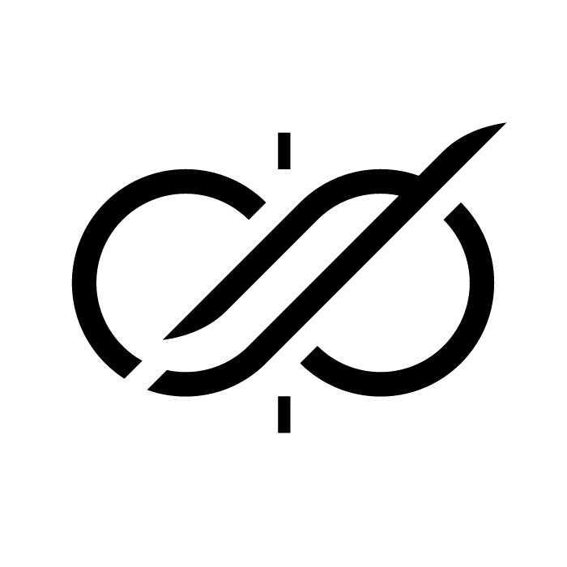
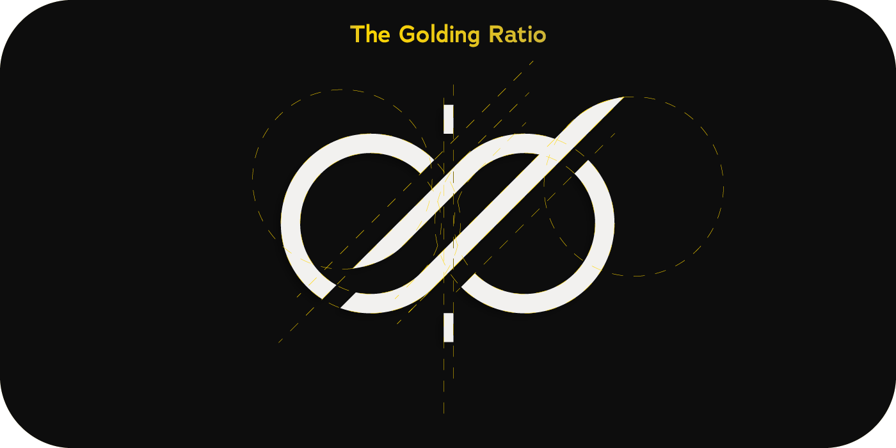
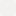

 <picture>
  
 </picture>
<h1 align="center">
  aeon — Identidade Visual
</h1>

## Visão Geral da Marca

Aeon é uma marca desenvolvida para representar um teclado split de alto padrão, projetado com as melhores peças disponíveis no mercado. Seu nome, que deriva da palavra "aeon" (ou éon), remete a um período de tempo imensurável, simbolizando eternidade, continuidade e atemporalidade. Essa referência reforça a proposta da marca: entregar um produto que transcende o tempo tanto em qualidade quanto em design.

 <picture>
  
 </picture>
<h2 align="center">
  Conceito da Logo
</h2>

A logo foi cuidadosamente desenhada com base na proporção áurea (Golden Ratio), buscando expressar perfeição, harmonia e sofisticação. As curvas suaves e simétricas se entrelaçam de forma equilibrada, remetendo ao símbolo do infinito ( ∞ ), uma representação direta da ideia de continuidade e longevidade. A divisão central reforça visualmente o conceito de "split", característica principal do teclado.

### Elementos Visuais

- **Infinito Cortado:** Remete à divisão dos teclados split, mas também à ideia de dois polos que operam em harmonia.
- **Simetria Geométrica:** Toda a estrutura da logo respeita proporções e alinhamentos com base na golden ratio, trazendo uma sensação inconsciente de ordem e perfeição.
- **Minimalismo:** A simplicidade da forma gera sofisticação e foco. Nada está em excesso, tudo é preciso.

### Mensagem Transmitida pela Marca

- **Eternidade e Tempo Infinito:** A forma do infinito aliada ao nome Aeon transmite a ideia de durabilidade, continuidade e imortalidade do design e funcionalidade.
- **Profissionalismo e Seriedade:** O uso das cores neutras e a precisão da geometria transmitem confiabilidade e alto padrão.
- **Sofisticação e Luxo:** Os elementos em dourado sugerem exclusividade, algo feito para quem entende e valoriza desempenho e beleza.

### Cores Base da Identidade Visual

-  **#0D0D0D — Preto Profundo**: transmite poder, elegância e modernidade.
-  **#FFFFFF — Branco Puro**: representa clareza, simplicidade e contraste ideal.
-  **#F2F1EF — Branco Quente**: cor de fundo ideal que adiciona sofisticação sem perder a leveza.
-  **#FFD700 — Dourado Clássico**: reforça a ideia de luxo e destaque premium.
-  **#CCB338 — Dourado Envelhecido**: para detalhes mais suaves e acabamento refinado.

A paleta de cores se adaptam tanto a contextos claros quanto escuros, garantindo versatilidade.

### Tipografia

#### Tipografia Principal

A tipografia escolhida para representar a identidade visual é a **Adrianna DemiBold**. Essa fonte une características clássicas com um toque contemporâneo, apresentando formas elegantes, curvas refinadas e um peso visual equilibrado. Ela reforça os pilares da marca ao transmitir seriedade, sofisticação e atemporalidade. Sua aplicação em títulos, logotipos e chamadas importantes confere autoridade sem abrir mão da estética minimalista.

#### Tipografia Secundária

Para compor a identidade visual de maneira equilibrada e versátil, escolhemos uma tipografia **serifada complementar** para trechos descritivos, conteúdos institucionais ou áreas que requerem leitura mais longa, optamos pela **Cormorant Garamond**.

## Conclusão

A logo do projeto aeon foi pensada desde o formato até a seleção minuciosa das cores, tudo foi pensado para transmitir precisão, valor e eternidade.
